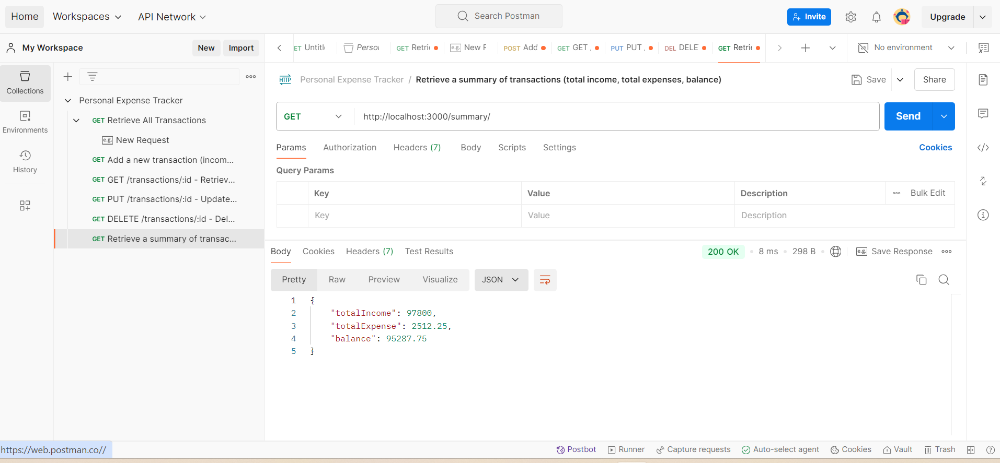

### Assignment: Personal Expense Tracker

### Objective:

Develop a RESTful API for managing personal financial records. Users can record their income and expenses, retrieve past transactions, and get summaries by category or time period.

### Tools and Technologies:

- **Backend Framework**: Node.js with Express.js
- **Database**: SQLite (for simplicity)

### Requirements:

1. **Database Setup**

   - If using **SQLite**, create a database with tables:
     - transactions: id, type (income or expense), category, amount, date, description
     - categories: id, name, type (income or expense)

2. **API Endpoints**
   - POST /transactions: Adds a new transaction (income or expense).
   - GET /transactions: Retrieves all transactions.
   - GET /transactions/:id: Retrieves a transaction by ID.
   - PUT /transactions/:id: Updates a transaction by ID.
   - DELETE /transactions/:id: Deletes a transaction by ID.
   - GET /summary: Retrieves a summary of transactions, such as total income, total expenses, and balance. Optionally, this can be filtered by date range or category.
3. **Functionality**
   - Implement route handlers for each endpoint.
   - Provide error handling to manage common issues like invalid transaction IDs, invalid inputs, etc.
   - Optionally add user authentication to protect the routes and associate transactions with specific users.
4. **Documentation**
   - Document your API endpoints with necessary request and response details.

### Deliverables:

- Source code in a GitHub repository.
- A README.md file that includes:
  - Setup and run instructions.
  - API documentation.
  - Postman screenshots demonstrating each API call.

### Bonus (Optional):

- Implement basic user authentication and link transactions to specific users.
- Add pagination to the GET /transactions endpoint to handle large volumes of data.
- Create an endpoint for generating reports, such as monthly spending by category.

- ### Postman Request/Response Screenshots

#### POST /transactions

#### GET /transactions

#### GET /transactions by id

#### Update /transactions by id

#### Delete /transactions by id

#### Get /Summary

 

 
